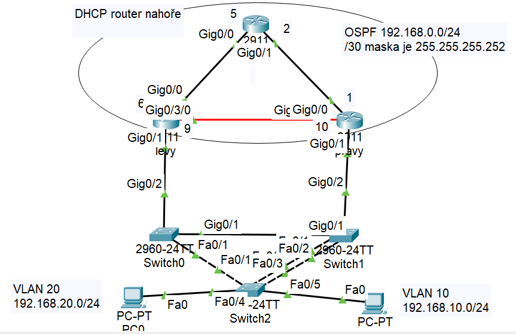

# Nový test, jak ho udělat?

# Postup:
**1)** Polož 3x router 2911, vlož do nich **HWIC-1NĚCO a  GLC-NĚCO**

**2)** Nastav routerům IP adresy, OSPF a Standby; dále vytvoř VLAN 10 a 20

**3)** Na horním routeru nastav DHCP pro vlany 10 a 20

**4)** 
